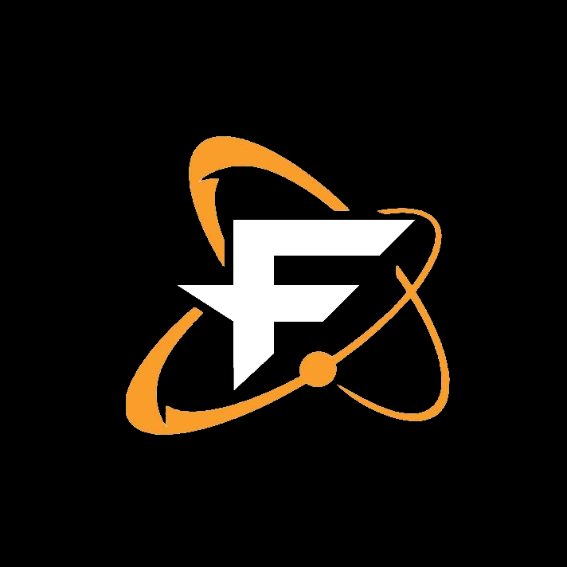

## Who I am

Hello, I am Firq, a 21 year old electrical engineering student from Germany. 

I am mostly developing tools and code related to work projects (see below), but I am also enjoying coding in my free time.

My interests range from gaming and anime to coding and computers in general. I am heavily invested into Fate/GO and the corresponding community.

### Socials

[][twitter]
[][twitter]

[][twitch]
[][twitch]

[][rayshift]

 
 
I am currently in the process of creating my own discord server.

## What I do

I am currently learing how do design electrical systems and program. Doing that, I come in contact with a lot of different languages and systems.

### Languages and Tools

[][python]
[][python]

[][pycharm]
[][pycharm]

[][c]
[][c]

[][cpp]
[][cpp]

[][git]
[][git]

[][git]
[][git]

[][github]
[][github]

[][gitlab]
[][gitlab]

[][jenkins]
[][jenkins]

 
 

I am also able to work with a variety of other programming, design and simulation tools, for example Matlab, Eagle or LTSpice, as well as with more specific languages like VHLD.

### Past projects

I won't go into that much details, since some of the projects are company-specific and restricted, but I can give a rundown of some of them.

#### Testing system for Localisation Sensor:

I programmed an automatic testing system which flashes firmware onto an localisation sensor and checks if any parameters got altered or if the sensor fails to fulfill its functionalities afterwards. For the project, I used Gitlab and Jenkins as a basis with Pytest as my testing framework. The main project consisted of creating a new communication method between the sensor and a connected PC via USB.

Used software and Tools:
- Python 3 (PyUSB, Pytest)
- Gitlab
- Jenkins

#### Testing system: Temperature drift

I helped design a testing system based on Matlab which tested the temperature drift of a sensor. This system is fully automated to run and document said tests.

### Plans for the future

I plan on learning new programming languages, such as Javascript, as well as expanding my knowledge in electrical engineering and programming in general.

I also want to start creating tools related to help with playing Fate Grand Order, such as a personal resource planner or an automatic damage and refund calculator.

### Credits

Icons by Iconmonstr (<https://iconmonstr.com/>) and Simple-Icons (<https://www.jsdelivr.com/package/npm/simple-icons>)

[twitter]: https://www.twitter.com/firq_ow
[rayshift]: https://www.rayshift.io/na/firq
[twitch]: https://www.twitch.tv/firq
[github]: https://github.com/Firq-ow
[pycharm]: https://www.jetbrains.com/pycharm/
[python]: https://www.python.org/
[c]: https://www.iso.org/standard/74528.html
[cpp]: https://isocpp.org/
[git]: https://git-scm.com/
[gitlab]: https://about.gitlab.com/
[jenkins]: https://www.jenkins.io/
